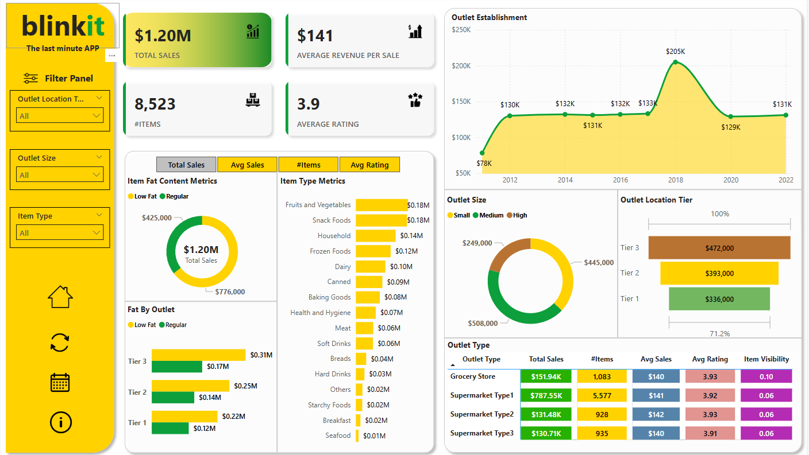

# Blinkit Power BI Sales Dashboard

An interactive Power BI dashboard designed to analyze Blinkit’s sales performance and inventory distribution using a rich set of KPIs and visualizations. This project highlights data storytelling through compelling charts, user-friendly navigation, and a sleek slicer toggle experience.

## 📊 Business Objectives

To deliver actionable insights into Blinkit's retail operations by examining:
- Total and average sales
- Product-level and outlet-level performance
- Customer satisfaction through rating metrics
- Geographic and categorical distribution of key business drivers

## ✅ KPI Highlights

- **Total Sales**: Overall revenue from items sold
- **Average Sales**: Revenue per sale
- **Number of Items Sold**: Total item count
- **Average Rating**: Mean customer rating per item

## 📈 Dashboard Visualizations

| Chart | Insight | Chart Type |
|-------|---------|------------|
| Sales by Fat Content | Impact of fat content on KPIs | Donut Chart |
| Sales by Item Type | Performance by product category | Bar Chart |
| Fat Content vs Outlet | Sales comparison by outlet segmentation | Stacked Column Chart |
| Sales by Establishment Year | Trends based on outlet longevity | Line Chart |
| Sales by Outlet Size | Revenue by store size | Donut/Pie Chart |
| Sales by Location | Geographic sales trends | Funnel Map |
| KPI Matrix by Outlet Type | Holistic breakdown of metrics by outlet | Matrix Card |

## 📷 Dashboard Preview

  
*Dashboard with key metrics and performance indicators*

## 🛠 Features

- Custom **calendar slicer icon** that toggles the date filter using bookmarks and transparent buttons.
- Clean, modern layout with focus on storytelling and business usability.
- Modular chart structure for seamless expansion or customization.

## 💡 Dataset Logic

Each row in the dataset represents a placed order and includes:
- Item identifiers, fat content, rating, sales amount
- Outlet information (type, location tier, size, establishment year)
- Item properties (type, weight, visibility)

## 🚀 Getting Started

1. Open the Power BI `.pbix` file.
2. Explore different KPIs and dimensions using slicers and filters.
3. Click the calendar icon to toggle the date filter.
4. Review metrics by outlet, item type, and more.

## 📚 Inspiration

This project was heavily inspired by the excellent walkthrough and instruction provided in the **Power BI & SQL Project | Data Analyst Portfolio** series by *Data Tutorials* on YouTube.  
Their step-by-step guidance played a major role in shaping my Power BI skills and building this dashboard.  
Huge thanks to their channel for making quality learning accessible to everyone!

##### [Check them out here](https://www.youtube.com/@DataTutorials1)
---

Feel free to fork, clone, or adapt this dashboard for your own use. Feedback and contributions welcome!

